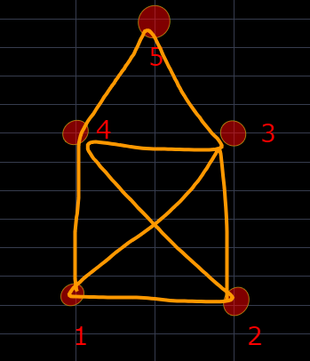

# MickeyMaler.github.io
4RedHat
*******************************************************************************************************
Project built using Mardown language with combination with Asciidoc. Written in Atom. Compiled into HTML

Source code
********************************************************************************************************

== The House with one move

Hello and welcome to this little guide which will help you to draw a house in one continual move in the way, where none of the paths of the graph has been used more than once.

### Introduction

This guide will show you how you can draw a house in one continuous move using a pen and paper or a stick and a piece of sandy beach.

### Prerequisites

* A piece of paper (or any other surface you want to use for drawing, carving)
* A pen (or a stick or a tool of your choice which will help you with lines creation)
* 5 minutes of your time

Get ready, we are about to start.

### Action

* Labeling the nodes of our “house” and imagination of the creation process

1. Imagine a simple square
2. Draw four little circles by the places where our imaginary square should have its corners. (picture one)

image::Images/zaklad.PNG[Corners of our house]

* Starting from the left bottom point, we will circulate in the counterclockwise direction, labeling the corner points with numbers from 1 to 4 (picture two)

image::Images/cisla.PNG[Orientation]

* When we are done with our first 4 points, we can put a fifth point (the top of the house)
somewhere in between points 3 - 4, slightly above our square construction. That will create our last point, the point number five

image::Images/5.PNG[Circle 5 is on the top]

* Since we have a backbone of our house created by those 5 points we can step forward to our finishing move.

### The move
We are almost done. Now we will create one simple continuous curve through all of our circles (vertexes). By doing so, we will have been creating our house in the way that ever edge (a unique path in between two numbers from our graph) will be used exactly once.

#### Procedure

Draw a line from point 1 and head north to point 4. Continue with your hand to point 5 and then change the direction at point 3. Now turn to the left to reach the point 4 again and then use a diagonal move to point 2. Turn left to get to the point 1 again and by another diagonal move reach point 3. Finish your house by turning south, back to do point 2.

If you have made those moves correctly you should be able to see something like this:

### Congratulation

Now you can use your imagination and try to come up with your own paths and possibilities in which a one can draw a house in one continual move in the way, where none of the paths of the graph has been used more than once.
